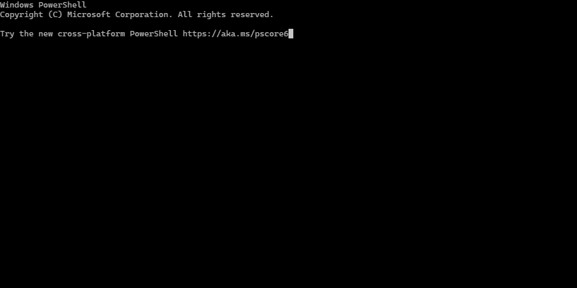

# `table-log`

> NPM utility tool to log lines as vertically aligned tabular data.



## Get Started

Install the tool via `yarn add table-log` or `npm i table-log --save`. Then import
the utility via

```typescript
import { CliTable } from 'table-log';
```

Then, initialize a new table with `table = CliTable.createNoBorderTable()`,
and invoke `table.log(...lines)` to log a new line. The table is automatically adjusted
whenever a new longest cell is logged.

Complete example:

```typescript
import { CliTable } from 'table-log';

const table = CliTable.createNoBorderTable({
  // Optional column alignments
  colAligns: ['left', 'right', 'left', 'right'],
  
  // Optional maximum column widths
  colWidths: [undefined, undefined, 35, undefined]
});

table.log('Received', 'GET', '/users/obi-wan-kenobi', '(352ms)');
table.log('Received', 'GET', '/users/vader', '(241ms)');
table.log('Received', 'POST', '/lightsabers/red/vader', '(890ms)');
table.log('Received', 'POST', '/lightsabers/blue/obi-wan-kenobi', '(937ms)');
table.log('Received', 'OPTIONS', '/lightsabers/new', '(125ms)');
table.log('Received', 'PUT', '/lightsabers/new', '(11,335ms)');
table.log('Received', 'GET', '/users/yoda', '(452ms)');
table.log('Received', 'POST', '/lightsabers/green/yoda', '(676ms)');

// There may also pass some time between renders
await new Promise(r => setTimeout(r, 2000));

table.log('Received', 'GET', '/lightsabers/green/yoda/handle/material', '(124ms)');

table.unmount();

console.log("Table unmounted!");
```

You can also create a table with a border, by invoking `CliTable.createSingleBorderTable()`
or `CliTable.createDoubleBorderTable()` instead of `CliTable.createNoBorderTable()`.


